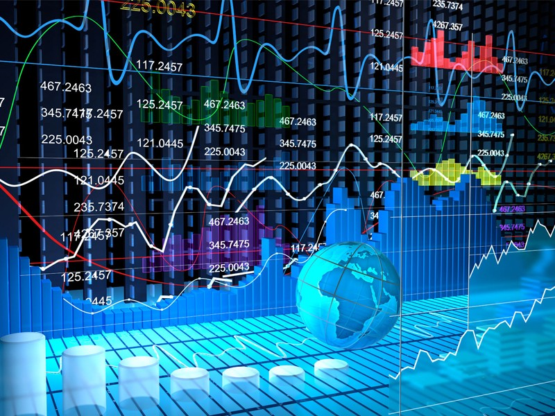

# Time-Series-and-Financial-In-DataScience-Course
Time series and Financial analysis in python
In this course i am going to cover the most important and crucial methods for time series analysis. I try to work on real world data
such as Apple and Amazon stocks since this is more realistic.

After this course you learn how to clean time series data, create incredible plots to show information also i use machine learning 
and deep learning methods to predict by using real world and effective algorithms such as markov and etc.

  

I try to cover important content for you to start your work as a Data Scientist for any suggestion you can email me.

aliemamalinezhad@gmail.com
